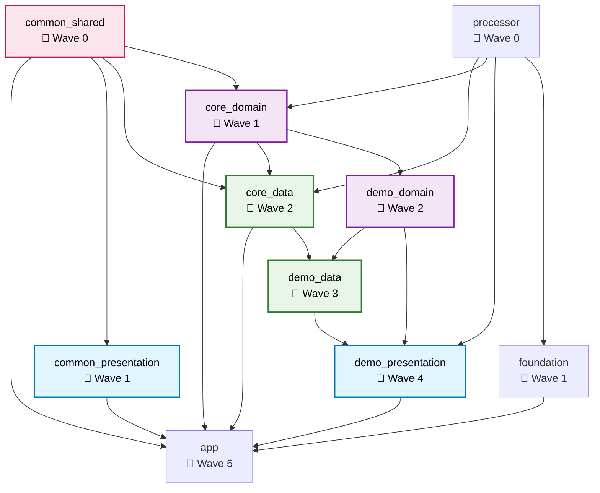

# Flutter Module Dependency Graph

## Visual Representation

## Build Statistics

- **Total Modules**: 10
- **Total Dependencies**: 19
- **Average Dependencies**: 1.90
- **Max Parallel Builds**: 8

## Build Waves

The modules will be built in the following waves:

### Wave 0

- **processor** → no dependencies
- **common_shared** → no dependencies

### Wave 1

- **common_presentation** → depends on: common_shared
- **core_domain** → depends on: processor, common_shared
- **foundation** → depends on: processor

### Wave 2

- **core_data** → depends on: processor, common_shared, core_domain
- **demo_domain** → depends on: core_domain

### Wave 3

- **demo_data** → depends on: core_data, demo_domain

### Wave 4

- **demo_presentation** → depends on: processor, demo_domain, demo_data

### Wave 5

- **app** → depends on: common_shared, common_presentation, core_domain, core_data, foundation, demo_presentation
