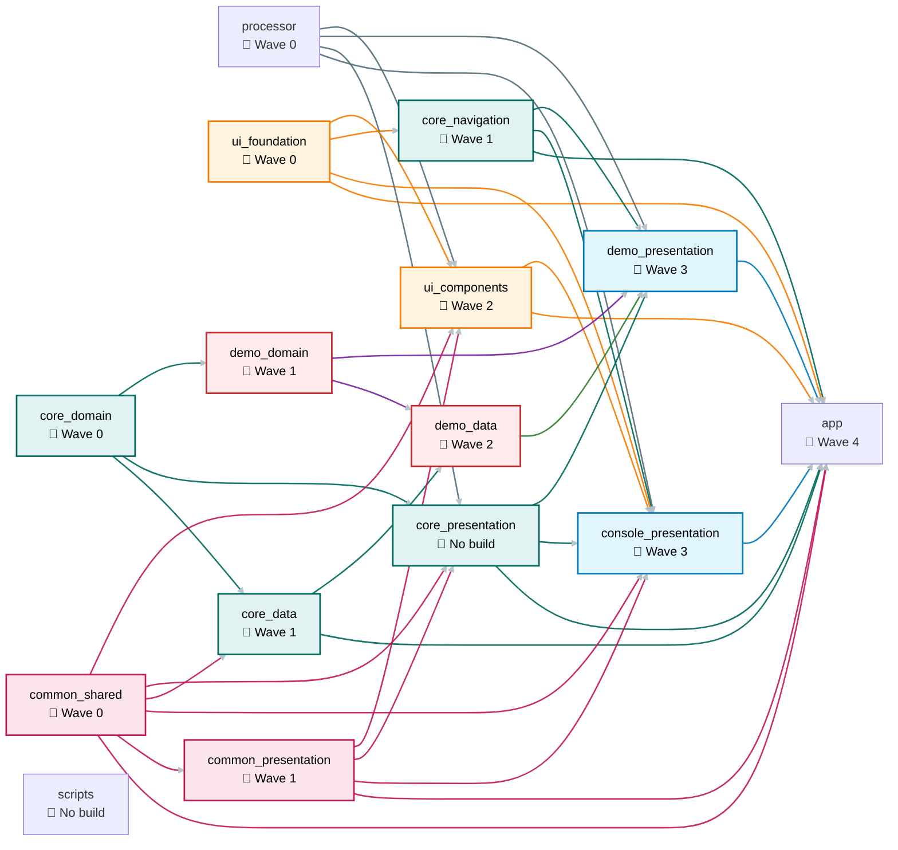

# Flutter Module Dependency Graph

## Visual Representation

## Build Statistics

- **Total Modules**: 15
- **Modules With build_runner**: 13
- **Modules Without build_runner**: 2
- **Total Dependencies**: 36
- **Average Dependencies**: 2.40
- **Peak Concurrent Modules**: 4
- **Configured Parallel Limit**: 4

## Build Waves

The modules requiring build_runner will be built in the following waves:

### Wave 0

- **processor** → no dependencies
- **common_shared** → no dependencies
- **core_domain** → no dependencies
- **ui_foundation** → no dependencies

### Wave 1

- **common_presentation** → depends on: common_shared
- **core_navigation** → depends on: ui_foundation
- **core_data** → depends on: common_shared, core_domain
- **demo_domain** → depends on: core_domain

### Wave 2

- **ui_components** → depends on: processor, common_presentation, common_shared, ui_foundation
- **demo_data** → depends on: core_data, demo_domain

### Wave 3

- **console_presentation** → depends on: processor, core_navigation, common_shared, common_presentation, ui_foundation, ui_components
- **demo_presentation** → depends on: processor, core_navigation, demo_domain, demo_data

### Wave 4

- **app** → depends on: common_shared, common_presentation, core_data, core_navigation, ui_foundation, ui_components, console_presentation, demo_presentation

## Unused Module Dependencies

The following modules declare workspace dependencies that are never imported:

- **demo_data** → core_data
- **demo_domain** → core_domain
