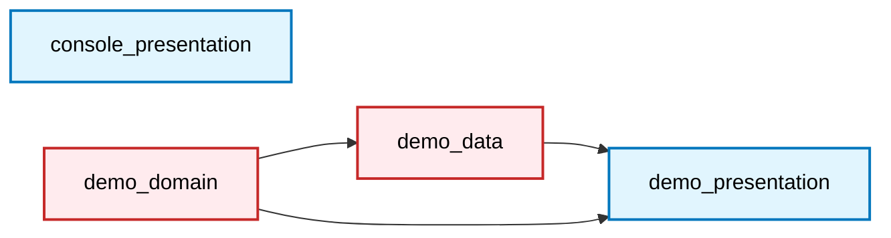

# Feature Modules

```mermaid
graph LR
    console_presentation["console_presentation"]
    console_presentation:::presentation
    demo_data["demo_data"]
    demo_data:::data
    class demo_data unused
    demo_domain["demo_domain"]
    demo_domain:::domain
    class demo_domain unused
    demo_presentation["demo_presentation"]
    demo_presentation:::presentation
    demo_domain --> demo_data
    demo_data --> demo_presentation
    demo_domain --> demo_presentation

    classDef presentation fill:#e1f5fe,stroke:#0277bd,stroke-width:2px,color:#000000;
    classDef domain fill:#f3e5f5,stroke:#7b1fa2,stroke-width:2px,color:#000000;
    classDef data fill:#e8f5e8,stroke:#2e7d32,stroke-width:2px,color:#000000;
    classDef unused fill:#ffebee,stroke:#c62828,stroke-width:2px,color:#000000;
```

