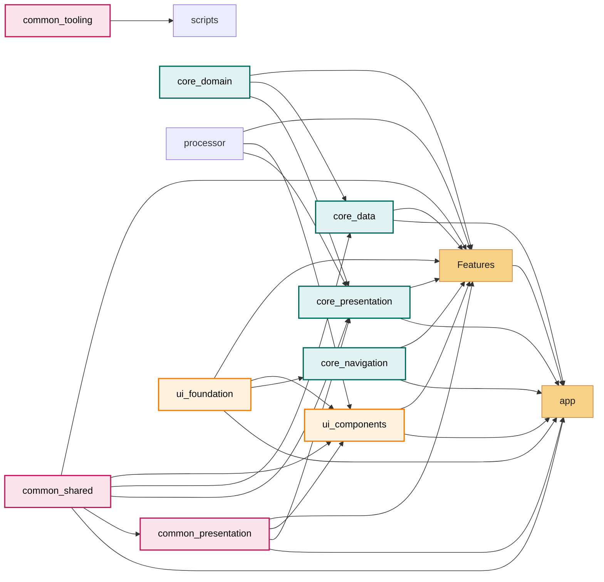

# Foundation Modules

```mermaid
graph LR
    app["app"]
    common_presentation["common_presentation"]
    common_presentation:::common
    common_shared["common_shared"]
    common_shared:::common
    common_tooling["common_tooling"]
    common_tooling:::common
    core_data["core_data"]
    core_data:::core
    core_domain["core_domain"]
    core_domain:::core
    core_navigation["core_navigation"]
    core_navigation:::core
    core_presentation["core_presentation"]
    core_presentation:::core
    processor["processor"]
    scripts["scripts"]
    ui_components["ui_components"]
    ui_components:::ui
    ui_foundation["ui_foundation"]
    ui_foundation:::ui
    class app feature
    common_tooling --> scripts
    common_shared --> app
    common_presentation --> app
    core_data --> app
    core_presentation --> app
    core_navigation --> app
    ui_foundation --> app
    ui_components --> app
    common_shared --> common_presentation
    processor --> core_presentation
    common_shared --> core_presentation
    common_presentation --> core_presentation
    core_domain --> core_presentation
    ui_foundation --> core_navigation
    common_shared --> core_data
    core_domain --> core_data
    processor --> ui_components
    common_presentation --> ui_components
    common_shared --> ui_components
    ui_foundation --> ui_components
    features["Features"]
    class features feature
    common_presentation --> features
    common_shared --> features
    core_data --> features
    core_domain --> features
    core_navigation --> features
    core_presentation --> features
    processor --> features
    ui_components --> features
    ui_foundation --> features
    features --> app

    classDef ui fill:#fff3e0,stroke:#f57c00,stroke-width:2px,color:#000000;
    classDef common fill:#fce4ec,stroke:#c2185b,stroke-width:2px,color:#000000;
    classDef core fill:#e0f2f1,stroke:#00695c,stroke-width:2px,color:#000000;
    classDef feature fill:#f6d186,stroke:#c77d39,color:#1b1b1b;
```

