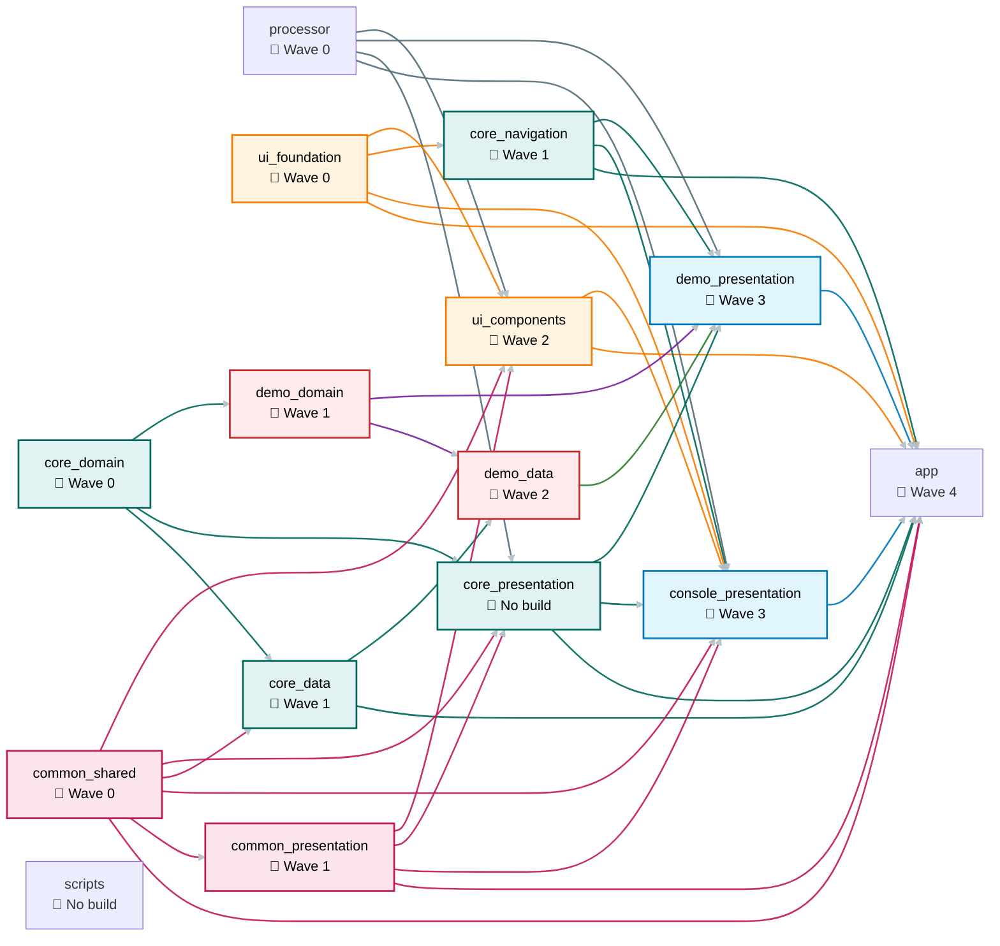

# Full Workspace Module Graph

Complete dependency graph sorted by build waves.

```mermaid
graph LR
    common_shared["common_shared\n🌊 Wave 0"]
    common_shared:::common
    core_domain["core_domain\n🌊 Wave 0"]
    core_domain:::core
    processor["processor\n🌊 Wave 0"]
    ui_foundation["ui_foundation\n🌊 Wave 0"]
    ui_foundation:::ui
    common_presentation["common_presentation\n🌊 Wave 1"]
    common_presentation:::common
    core_data["core_data\n🌊 Wave 1"]
    core_data:::core
    core_navigation["core_navigation\n🌊 Wave 1"]
    core_navigation:::core
    demo_domain["demo_domain\n🌊 Wave 1"]
    demo_domain:::domain
    class demo_domain unused;
    demo_data["demo_data\n🌊 Wave 2"]
    demo_data:::data
    class demo_data unused;
    ui_components["ui_components\n🌊 Wave 2"]
    ui_components:::ui
    console_presentation["console_presentation\n🌊 Wave 3"]
    console_presentation:::presentation
    demo_presentation["demo_presentation\n🌊 Wave 3"]
    demo_presentation:::presentation
    app["app\n🌊 Wave 4"]
    core_presentation["core_presentation\n🚫 No build"]
    core_presentation:::core
    scripts["scripts\n🚫 No build"]

    %% Edge styling
    linkStyle default stroke:#b0bec5,stroke-width:1,opacity:0.35
    common_presentation --> app
    common_shared --> app
    console_presentation --> app
    core_data --> app
    core_navigation --> app
    core_presentation --> app
    demo_presentation --> app
    ui_components --> app
    ui_foundation --> app
    common_shared --> common_presentation
    common_presentation --> console_presentation
    common_shared --> console_presentation
    core_navigation --> console_presentation
    core_presentation --> console_presentation
    processor --> console_presentation
    ui_components --> console_presentation
    ui_foundation --> console_presentation
    common_shared --> core_data
    core_domain --> core_data
    ui_foundation --> core_navigation
    common_presentation --> core_presentation
    common_shared --> core_presentation
    core_domain --> core_presentation
    processor --> core_presentation
    core_data --> demo_data
    demo_domain --> demo_data
    core_domain --> demo_domain
    core_navigation --> demo_presentation
    core_presentation --> demo_presentation
    demo_data --> demo_presentation
    demo_domain --> demo_presentation
    processor --> demo_presentation
    common_presentation --> ui_components
    common_shared --> ui_components
    processor --> ui_components
    ui_foundation --> ui_components

    linkStyle 0,1,9,10,11,17,20,21,32,33 stroke:#c2185b,stroke-width:1.9,opacity:0.9
    linkStyle 2,6 stroke:#0277bd,stroke-width:1.9,opacity:0.9
    linkStyle 3,4,5,12,13,18,22,24,26,27,28 stroke:#00695c,stroke-width:1.9,opacity:0.9
    linkStyle 7,8,15,16,19,35 stroke:#f57c00,stroke-width:1.9,opacity:0.9
    linkStyle 14,23,31,34 stroke:#546e7a,stroke-width:1.9,opacity:0.9
    linkStyle 25,30 stroke:#7b1fa2,stroke-width:1.9,opacity:0.9
    linkStyle 29 stroke:#2e7d32,stroke-width:1.9,opacity:0.9

    classDef presentation fill:#e1f5fe,stroke:#0277bd,stroke-width:2px,color:#000000
    classDef domain fill:#f3e5f5,stroke:#7b1fa2,stroke-width:2px,color:#000000
    classDef data fill:#e8f5e8,stroke:#2e7d32,stroke-width:2px,color:#000000
    classDef ui fill:#fff3e0,stroke:#f57c00,stroke-width:2px,color:#000000
    classDef common fill:#fce4ec,stroke:#c2185b,stroke-width:2px,color:#000000
    classDef core fill:#e0f2f1,stroke:#00695c,stroke-width:2px,color:#000000
    classDef unused fill:#ffebee,stroke:#c62828,stroke-width:2px,color:#000000
```

