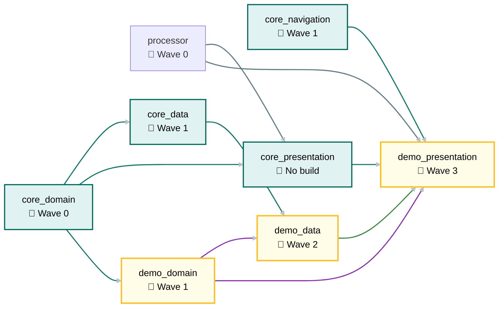

# Demo Feature Graph

Modules under feature/demo with their dependencies.

```mermaid
graph LR
    core_domain["core_domain\n🌊 Wave 0"]
    core_domain:::core
    processor["processor\n🌊 Wave 0"]
    core_data["core_data\n🌊 Wave 1"]
    core_data:::core
    core_navigation["core_navigation\n🌊 Wave 1"]
    core_navigation:::core
    demo_domain["demo_domain\n🌊 Wave 1"]
    demo_domain:::domain
    class demo_domain unused;
    class demo_domain focus;
    demo_data["demo_data\n🌊 Wave 2"]
    demo_data:::data
    class demo_data unused;
    class demo_data focus;
    demo_presentation["demo_presentation\n🌊 Wave 3"]
    demo_presentation:::presentation
    class demo_presentation focus;
    core_presentation["core_presentation\n🚫 No build"]
    core_presentation:::core

    %% Edge styling
    linkStyle default stroke:#b0bec5,stroke-width:1,opacity:0.35
    core_domain --> core_data
    core_domain --> core_presentation
    processor --> core_presentation
    core_data --> demo_data
    demo_domain --> demo_data
    core_domain --> demo_domain
    core_navigation --> demo_presentation
    core_presentation --> demo_presentation
    demo_data --> demo_presentation
    demo_domain --> demo_presentation
    processor --> demo_presentation

    linkStyle 0,1,3,5,6,7 stroke:#00695c,stroke-width:1.9,opacity:0.9
    linkStyle 2,10 stroke:#546e7a,stroke-width:1.9,opacity:0.9
    linkStyle 4,9 stroke:#7b1fa2,stroke-width:1.9,opacity:0.9
    linkStyle 8 stroke:#2e7d32,stroke-width:1.9,opacity:0.9

    classDef presentation fill:#e1f5fe,stroke:#0277bd,stroke-width:2px,color:#000000
    classDef domain fill:#f3e5f5,stroke:#7b1fa2,stroke-width:2px,color:#000000
    classDef data fill:#e8f5e8,stroke:#2e7d32,stroke-width:2px,color:#000000
    classDef core fill:#e0f2f1,stroke:#00695c,stroke-width:2px,color:#000000
    classDef unused fill:#ffebee,stroke:#c62828,stroke-width:2px,color:#000000
    classDef focus fill:#fffde7,stroke:#fbc02d,stroke-width:2.5px,color:#000000
```

