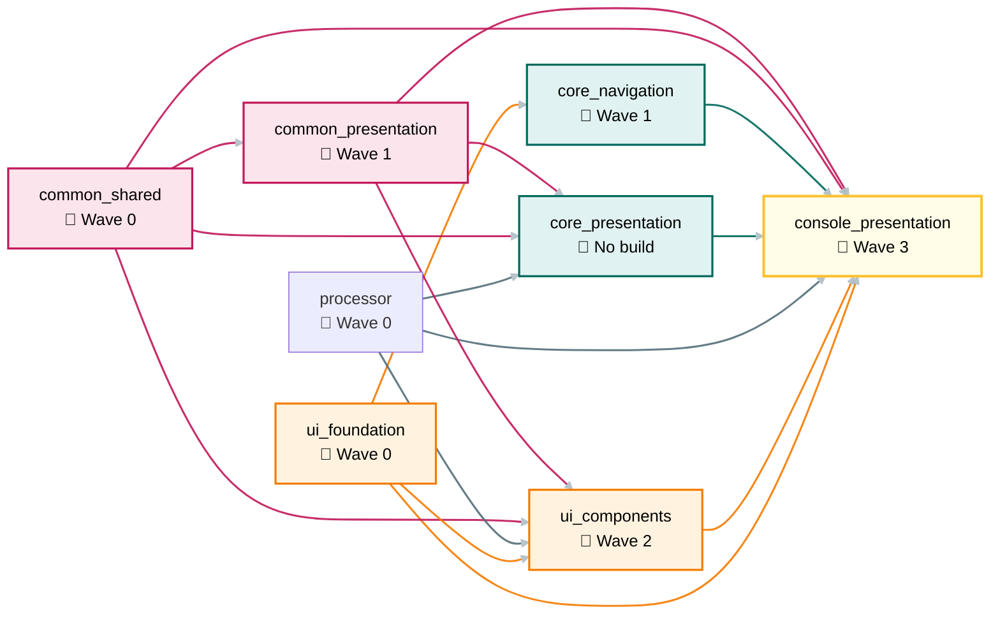

# Global Feature Graph

Modules under feature/global with their dependencies.

```mermaid
graph LR
    common_shared["common_shared\n🌊 Wave 0"]
    common_shared:::common
    processor["processor\n🌊 Wave 0"]
    ui_foundation["ui_foundation\n🌊 Wave 0"]
    ui_foundation:::ui
    common_presentation["common_presentation\n🌊 Wave 1"]
    common_presentation:::common
    core_navigation["core_navigation\n🌊 Wave 1"]
    core_navigation:::core
    ui_components["ui_components\n🌊 Wave 2"]
    ui_components:::ui
    console_presentation["console_presentation\n🌊 Wave 3"]
    console_presentation:::presentation
    class console_presentation focus;
    core_presentation["core_presentation\n🚫 No build"]
    core_presentation:::core

    %% Edge styling
    linkStyle default stroke:#b0bec5,stroke-width:1,opacity:0.35
    common_shared --> common_presentation
    common_presentation --> console_presentation
    common_shared --> console_presentation
    core_navigation --> console_presentation
    core_presentation --> console_presentation
    processor --> console_presentation
    ui_components --> console_presentation
    ui_foundation --> console_presentation
    ui_foundation --> core_navigation
    common_presentation --> core_presentation
    common_shared --> core_presentation
    processor --> core_presentation
    common_presentation --> ui_components
    common_shared --> ui_components
    processor --> ui_components
    ui_foundation --> ui_components

    linkStyle 0,1,2,9,10,12,13 stroke:#c2185b,stroke-width:1.9,opacity:0.9
    linkStyle 3,4 stroke:#00695c,stroke-width:1.9,opacity:0.9
    linkStyle 5,11,14 stroke:#546e7a,stroke-width:1.9,opacity:0.9
    linkStyle 6,7,8,15 stroke:#f57c00,stroke-width:1.9,opacity:0.9

    classDef presentation fill:#e1f5fe,stroke:#0277bd,stroke-width:2px,color:#000000
    classDef ui fill:#fff3e0,stroke:#f57c00,stroke-width:2px,color:#000000
    classDef common fill:#fce4ec,stroke:#c2185b,stroke-width:2px,color:#000000
    classDef core fill:#e0f2f1,stroke:#00695c,stroke-width:2px,color:#000000
    classDef focus fill:#fffde7,stroke:#fbc02d,stroke-width:2.5px,color:#000000
```

