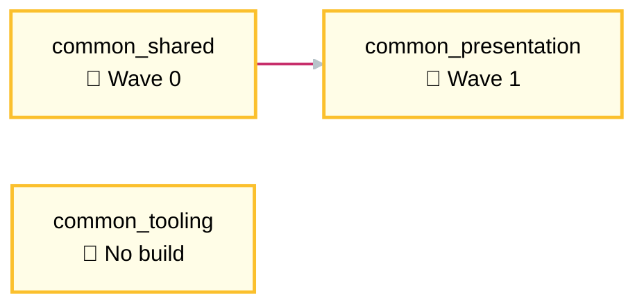

# Common Layer Graph

Common Layer modules with their workspace dependencies.

```mermaid
graph LR
    common_shared["common_shared\n🌊 Wave 0"]
    common_shared:::common
    class common_shared focus;
    common_presentation["common_presentation\n🌊 Wave 1"]
    common_presentation:::common
    class common_presentation focus;
    common_tooling["common_tooling\n🚫 No build"]
    common_tooling:::common
    class common_tooling focus;

    %% Edge styling
    linkStyle default stroke:#b0bec5,stroke-width:1,opacity:0.35
    common_shared --> common_presentation

    linkStyle 0 stroke:#c2185b,stroke-width:1.9,opacity:0.9

    classDef common fill:#fce4ec,stroke:#c2185b,stroke-width:2px,color:#000000
    classDef focus fill:#fffde7,stroke:#fbc02d,stroke-width:2.5px,color:#000000
```

