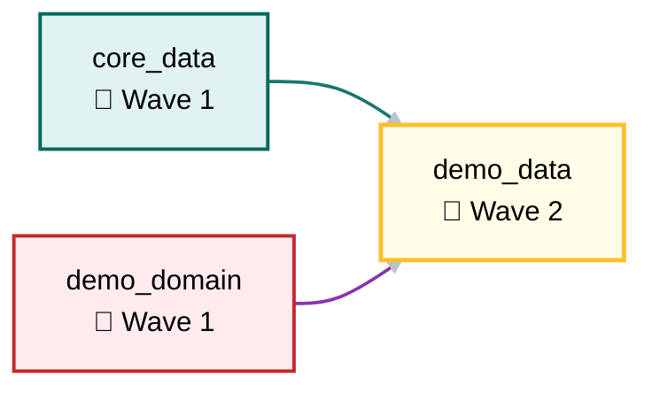

# Data Layer Graph

Data Layer modules with their workspace dependencies.

```mermaid
graph LR
    core_data["core_data\n🌊 Wave 1"]
    core_data:::core
    demo_domain["demo_domain\n🌊 Wave 1"]
    demo_domain:::domain
    class demo_domain unused;
    demo_data["demo_data\n🌊 Wave 2"]
    demo_data:::data
    class demo_data unused;
    class demo_data focus;

    %% Edge styling
    linkStyle default stroke:#b0bec5,stroke-width:1,opacity:0.35
    core_data --> demo_data
    demo_domain --> demo_data

    linkStyle 0 stroke:#00695c,stroke-width:1.9,opacity:0.9
    linkStyle 1 stroke:#7b1fa2,stroke-width:1.9,opacity:0.9

    classDef domain fill:#f3e5f5,stroke:#7b1fa2,stroke-width:2px,color:#000000
    classDef data fill:#e8f5e8,stroke:#2e7d32,stroke-width:2px,color:#000000
    classDef core fill:#e0f2f1,stroke:#00695c,stroke-width:2px,color:#000000
    classDef unused fill:#ffebee,stroke:#c62828,stroke-width:2px,color:#000000
    classDef focus fill:#fffde7,stroke:#fbc02d,stroke-width:2.5px,color:#000000
```

