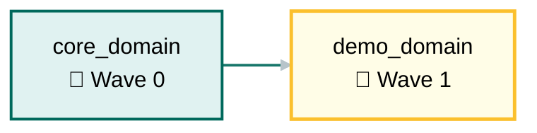

# Domain Layer Graph

Domain Layer modules with their workspace dependencies.

```mermaid
graph LR
    core_domain["core_domain\n🌊 Wave 0"]
    core_domain:::core
    demo_domain["demo_domain\n🌊 Wave 1"]
    demo_domain:::domain
    class demo_domain unused;
    class demo_domain focus;

    %% Edge styling
    linkStyle default stroke:#b0bec5,stroke-width:1,opacity:0.35
    core_domain --> demo_domain

    linkStyle 0 stroke:#00695c,stroke-width:1.9,opacity:0.9

    classDef domain fill:#f3e5f5,stroke:#7b1fa2,stroke-width:2px,color:#000000
    classDef core fill:#e0f2f1,stroke:#00695c,stroke-width:2px,color:#000000
    classDef unused fill:#ffebee,stroke:#c62828,stroke-width:2px,color:#000000
    classDef focus fill:#fffde7,stroke:#fbc02d,stroke-width:2.5px,color:#000000
```

