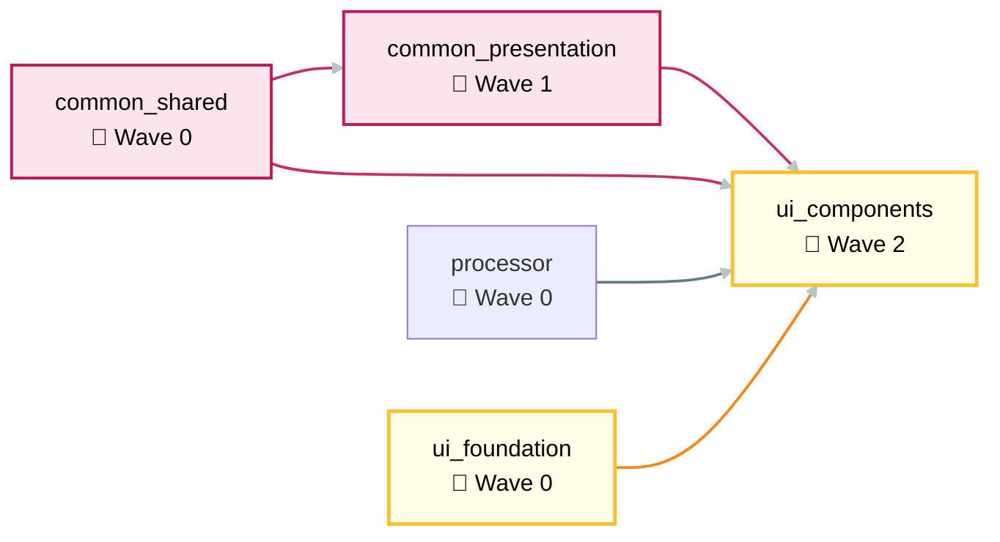

# UI Layer Graph

UI Layer modules with their workspace dependencies.

```mermaid
graph LR
    common_shared["common_shared\n🌊 Wave 0"]
    common_shared:::common
    processor["processor\n🌊 Wave 0"]
    ui_foundation["ui_foundation\n🌊 Wave 0"]
    ui_foundation:::ui
    class ui_foundation focus;
    common_presentation["common_presentation\n🌊 Wave 1"]
    common_presentation:::common
    ui_components["ui_components\n🌊 Wave 2"]
    ui_components:::ui
    class ui_components focus;

    %% Edge styling
    linkStyle default stroke:#b0bec5,stroke-width:1,opacity:0.35
    common_shared --> common_presentation
    common_presentation --> ui_components
    common_shared --> ui_components
    processor --> ui_components
    ui_foundation --> ui_components

    linkStyle 0,1,2 stroke:#c2185b,stroke-width:1.9,opacity:0.9
    linkStyle 3 stroke:#546e7a,stroke-width:1.9,opacity:0.9
    linkStyle 4 stroke:#f57c00,stroke-width:1.9,opacity:0.9

    classDef ui fill:#fff3e0,stroke:#f57c00,stroke-width:2px,color:#000000
    classDef common fill:#fce4ec,stroke:#c2185b,stroke-width:2px,color:#000000
    classDef focus fill:#fffde7,stroke:#fbc02d,stroke-width:2.5px,color:#000000
```

