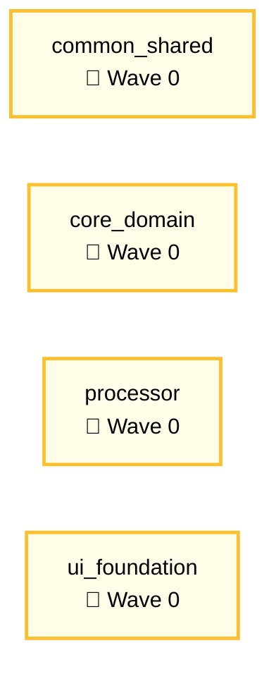

# Wave 0 Dependency Graph

Modules scheduled in wave 0 with their workspace dependencies.

```mermaid
graph LR
    common_shared["common_shared\n🌊 Wave 0"]
    common_shared:::common
    class common_shared focus;
    core_domain["core_domain\n🌊 Wave 0"]
    core_domain:::core
    class core_domain focus;
    processor["processor\n🌊 Wave 0"]
    class processor focus;
    ui_foundation["ui_foundation\n🌊 Wave 0"]
    ui_foundation:::ui
    class ui_foundation focus;

    %% Edge styling
    linkStyle default stroke:#b0bec5,stroke-width:1,opacity:0.35

    classDef ui fill:#fff3e0,stroke:#f57c00,stroke-width:2px,color:#000000
    classDef common fill:#fce4ec,stroke:#c2185b,stroke-width:2px,color:#000000
    classDef core fill:#e0f2f1,stroke:#00695c,stroke-width:2px,color:#000000
    classDef focus fill:#fffde7,stroke:#fbc02d,stroke-width:2.5px,color:#000000
```

