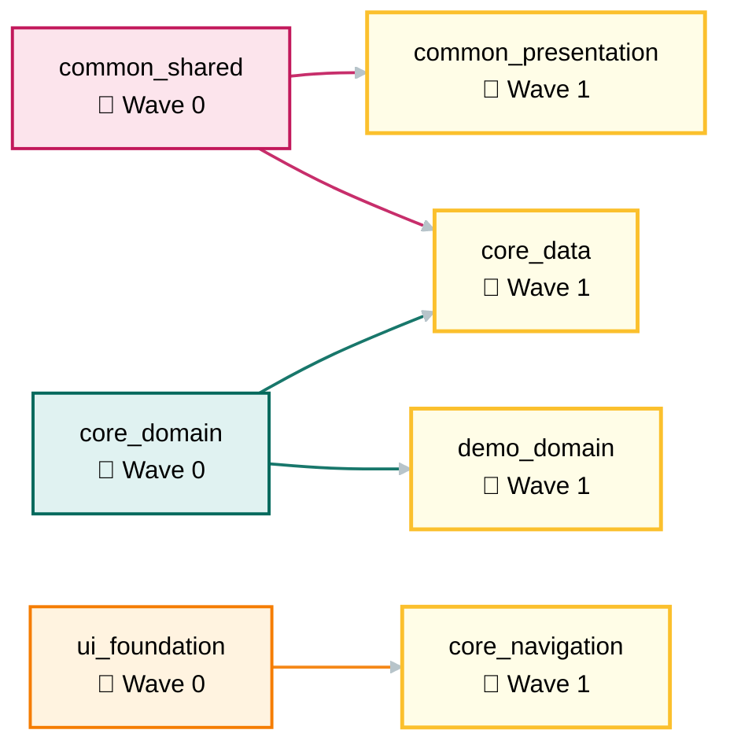

# Wave 1 Dependency Graph

Modules scheduled in wave 1 with their workspace dependencies.

```mermaid
graph LR
    common_shared["common_shared\n🌊 Wave 0"]
    common_shared:::common
    core_domain["core_domain\n🌊 Wave 0"]
    core_domain:::core
    ui_foundation["ui_foundation\n🌊 Wave 0"]
    ui_foundation:::ui
    common_presentation["common_presentation\n🌊 Wave 1"]
    common_presentation:::common
    class common_presentation focus;
    core_data["core_data\n🌊 Wave 1"]
    core_data:::core
    class core_data focus;
    core_navigation["core_navigation\n🌊 Wave 1"]
    core_navigation:::core
    class core_navigation focus;
    demo_domain["demo_domain\n🌊 Wave 1"]
    demo_domain:::domain
    class demo_domain unused;
    class demo_domain focus;

    %% Edge styling
    linkStyle default stroke:#b0bec5,stroke-width:1,opacity:0.35
    common_shared --> common_presentation
    common_shared --> core_data
    core_domain --> core_data
    ui_foundation --> core_navigation
    core_domain --> demo_domain

    linkStyle 0,1 stroke:#c2185b,stroke-width:1.9,opacity:0.9
    linkStyle 2,4 stroke:#00695c,stroke-width:1.9,opacity:0.9
    linkStyle 3 stroke:#f57c00,stroke-width:1.9,opacity:0.9

    classDef domain fill:#f3e5f5,stroke:#7b1fa2,stroke-width:2px,color:#000000
    classDef ui fill:#fff3e0,stroke:#f57c00,stroke-width:2px,color:#000000
    classDef common fill:#fce4ec,stroke:#c2185b,stroke-width:2px,color:#000000
    classDef core fill:#e0f2f1,stroke:#00695c,stroke-width:2px,color:#000000
    classDef unused fill:#ffebee,stroke:#c62828,stroke-width:2px,color:#000000
    classDef focus fill:#fffde7,stroke:#fbc02d,stroke-width:2.5px,color:#000000
```

