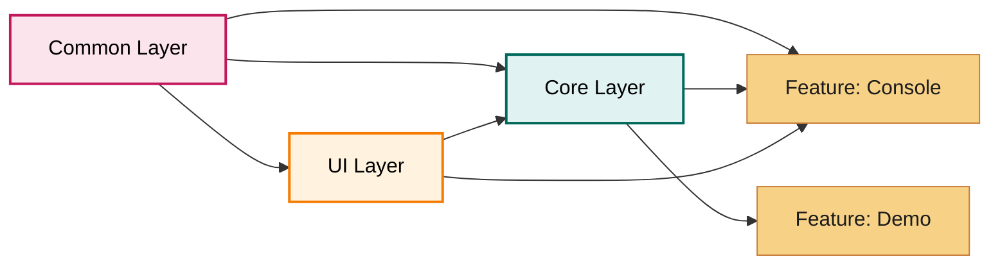

# Layers

```mermaid
graph LR
    group_Core_Layer["Core Layer"]
    class group_Core_Layer core
    group_Common_Layer["Common Layer"]
    class group_Common_Layer common
    group_UI_Layer["UI Layer"]
    class group_UI_Layer ui
    group_Feature__Console["Feature: Console"]
    class group_Feature__Console feature
    group_Feature__Demo["Feature: Demo"]
    class group_Feature__Demo feature
    group_Common_Layer --> group_Core_Layer
    group_UI_Layer --> group_Core_Layer
    group_Common_Layer --> group_UI_Layer
    group_Common_Layer --> group_Feature__Console
    group_Core_Layer --> group_Feature__Console
    group_UI_Layer --> group_Feature__Console
    group_Core_Layer --> group_Feature__Demo

    classDef ui fill:#fff3e0,stroke:#f57c00,stroke-width:2px,color:#000000;
    classDef common fill:#fce4ec,stroke:#c2185b,stroke-width:2px,color:#000000;
    classDef core fill:#e0f2f1,stroke:#00695c,stroke-width:2px,color:#000000;
    classDef feature fill:#f6d186,stroke:#c77d39,color:#1b1b1b;
```

