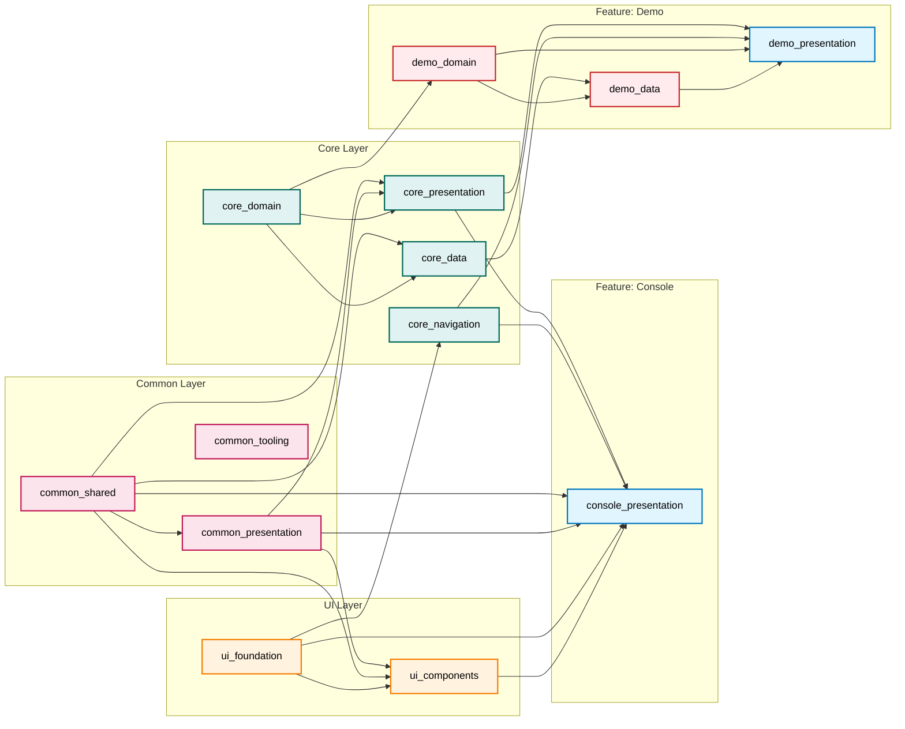

# Module Groups

```mermaid
graph LR
    subgraph "Core Layer"
        direction LR
        core_data["core_data"]
        core_data:::core
        core_domain["core_domain"]
        core_domain:::core
        core_navigation["core_navigation"]
        core_navigation:::core
        core_presentation["core_presentation"]
        core_presentation:::core
    end
    subgraph "Common Layer"
        direction LR
        common_presentation["common_presentation"]
        common_presentation:::common
        common_shared["common_shared"]
        common_shared:::common
        common_tooling["common_tooling"]
        common_tooling:::common
    end
    subgraph "UI Layer"
        direction LR
        ui_components["ui_components"]
        ui_components:::ui
        ui_foundation["ui_foundation"]
        ui_foundation:::ui
    end
    subgraph "Feature: Console"
        direction LR
        console_presentation["console_presentation"]
        console_presentation:::presentation
    end
    subgraph "Feature: Demo"
        direction LR
        demo_data["demo_data"]
        demo_data:::data
        class demo_data unused
        demo_domain["demo_domain"]
        demo_domain:::domain
        class demo_domain unused
        demo_presentation["demo_presentation"]
        demo_presentation:::presentation
    end
    common_shared --> common_presentation
    common_shared --> core_presentation
    common_presentation --> core_presentation
    core_domain --> core_presentation
    ui_foundation --> core_navigation
    common_shared --> core_data
    core_domain --> core_data
    common_presentation --> ui_components
    common_shared --> ui_components
    ui_foundation --> ui_components
    core_presentation --> console_presentation
    core_navigation --> console_presentation
    common_shared --> console_presentation
    common_presentation --> console_presentation
    ui_foundation --> console_presentation
    ui_components --> console_presentation
    core_domain --> demo_domain
    core_data --> demo_data
    demo_domain --> demo_data
    core_presentation --> demo_presentation
    core_navigation --> demo_presentation
    demo_domain --> demo_presentation
    demo_data --> demo_presentation

    classDef presentation fill:#e1f5fe,stroke:#0277bd,stroke-width:2px,color:#000000;
    classDef domain fill:#f3e5f5,stroke:#7b1fa2,stroke-width:2px,color:#000000;
    classDef data fill:#e8f5e8,stroke:#2e7d32,stroke-width:2px,color:#000000;
    classDef ui fill:#fff3e0,stroke:#f57c00,stroke-width:2px,color:#000000;
    classDef common fill:#fce4ec,stroke:#c2185b,stroke-width:2px,color:#000000;
    classDef core fill:#e0f2f1,stroke:#00695c,stroke-width:2px,color:#000000;
    classDef unused fill:#ffebee,stroke:#c62828,stroke-width:2px,color:#000000;
```

