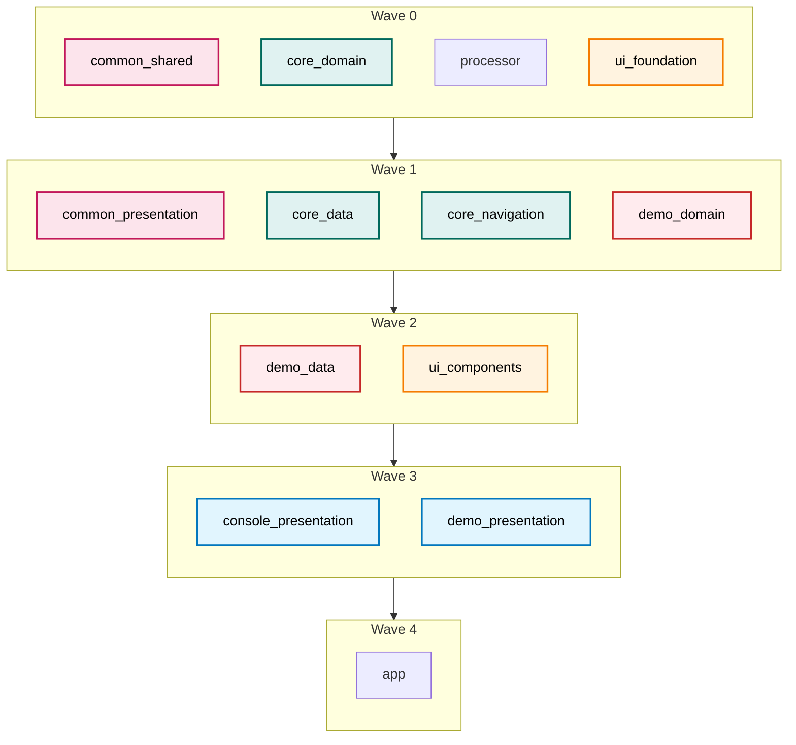

# Waves Overview

```mermaid
graph TB
    subgraph wave_cluster_0["Wave 0"]
        direction TB
        common_shared["common_shared"]
        common_shared:::common
        core_domain["core_domain"]
        core_domain:::core
        processor["processor"]
        ui_foundation["ui_foundation"]
        ui_foundation:::ui
    end
    subgraph wave_cluster_1["Wave 1"]
        direction TB
        common_presentation["common_presentation"]
        common_presentation:::common
        core_data["core_data"]
        core_data:::core
        core_navigation["core_navigation"]
        core_navigation:::core
        demo_domain["demo_domain"]
        demo_domain:::domain
        class demo_domain unused
    end
    subgraph wave_cluster_2["Wave 2"]
        direction TB
        demo_data["demo_data"]
        demo_data:::data
        class demo_data unused
        ui_components["ui_components"]
        ui_components:::ui
    end
    subgraph wave_cluster_3["Wave 3"]
        direction TB
        console_presentation["console_presentation"]
        console_presentation:::presentation
        demo_presentation["demo_presentation"]
        demo_presentation:::presentation
    end
    subgraph wave_cluster_4["Wave 4"]
        direction TB
        app["app"]
    end
    wave_cluster_0 --> wave_cluster_1
    wave_cluster_1 --> wave_cluster_2
    wave_cluster_2 --> wave_cluster_3
    wave_cluster_3 --> wave_cluster_4

    classDef presentation fill:#e1f5fe,stroke:#0277bd,stroke-width:2px,color:#000000;
    classDef domain fill:#f3e5f5,stroke:#7b1fa2,stroke-width:2px,color:#000000;
    classDef data fill:#e8f5e8,stroke:#2e7d32,stroke-width:2px,color:#000000;
    classDef ui fill:#fff3e0,stroke:#f57c00,stroke-width:2px,color:#000000;
    classDef common fill:#fce4ec,stroke:#c2185b,stroke-width:2px,color:#000000;
    classDef core fill:#e0f2f1,stroke:#00695c,stroke-width:2px,color:#000000;
    classDef unused fill:#ffebee,stroke:#c62828,stroke-width:2px,color:#000000;
```

