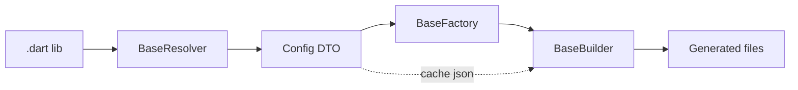

# Generator Core

`generator/core` provides the scaffolding that every custom builder in the workspace relies on. It orchestrates how annotated source files are discovered, converted into configuration objects, cached between builds, and turned into generated Dart code

## Architecture at a glance

1. **BaseBuilder** locates libraries that use a specific annotation type and delegates to the resolver/factory pair.
2. **BaseResolver** inspects analyzer elements, producing a serialisable config object (e.g. `DataConfig`).
3. **BaseFactory** consumes the config, writes `code_builder` specs into a buffer, and formats the generated output.
4. `BaseBuilder` writes both the `.g.dart` part file and any additional outputs declared in `build.yaml`.
5. Config snapshots are cached under `.dart_tool/build/cache` so subsequent builds can skip work when nothing changed.

## Key components

### BaseBuilder<Config, Target>

- Accepts a `Target` analyzer element type (e.g. `ClassElement2`).
- Validates the `generatedExtension` and optional additional outputs.
- Supports cached builds: a stable hash (supplied by `calculateUpdatableHash`) is stored alongside the JSON-encoded config. If the source hash matches, the builder replays the cached config without re-resolving elements.
- Provides `hasAnyTopLevelAnnotations` to short-circuit work for libraries that do not use the relevant annotation.
- Handles `part` files by auto-creating the `.g.dart` companion if it does not exist.
- Normalizes formatting by piping results through `dart_style` unless formatting fails, in which case the raw code is emitted with a warning.

### BaseResolver<Config, Target>

- Lightweight interface (`Future<Config?> resolve(Target element)`).
- Implementations in downstream packages (e.g. `DataResolver`, `ViewResolver`) map analyzer metadata to config DTOs.
- The resolver is responsible for throwing explicit `InvalidGenerationSourceError`s when a contract is misused (e.g. missing required parameters).

### BaseFactory<Config>

- Wraps a `StringBuffer`, `DartEmitter`, and `DartFormatter`.
- Implementations build `code_builder` specs (classes, extensions, methods) and call `writeSpec` to append formatted source to the buffer.
- The buffer content becomes the body of the generated part file.

### Shared utilities

- `constants/strings.dart`: Canonical names for common Flutter and project-specific types (`BuildContext`, `StatefulWidget`, effect cache path, etc.). Keeping these centralized prevents spelling mismatches between resolvers and factories.
- `extensions/`: Utility extensions for `DartType` (nullability/primitive checks) and `String` (normalization helpers used to derive class names).
- `utils/throw.dart`: Small helpers (`throwIf`, `throwError`) that standardize error reporting.

## Build lifecycle

1. **File discovery** – build_runner detects a library that the builder cares about. `BaseBuilder.build` checks if it is a library and whether it contains the annotation.
2. **Cache lookup** – if caching is enabled and the stored hash matches, the cached config is used and steps 3–4 are skipped.
3. **Resolution** – the resolver walks the annotated element, constructing a config object. Any structural issues (missing `part` directive, invalid constructor, duplicate effect names) surface here via `throwIf`.
4. **Generation** – the factory converts the config into Dart source. This includes writing supporting comments (`// GENERATED CODE - DO NOT MODIFY BY HAND`) and ensuring the `part of` directive references the originating file.
5. **Emission** – the formatted output is written to disk. Additional outputs (e.g. `view_kit` effect cache, exporter `public.dart`) are handled by the specific builder implementation.

## Extending the core layer

When adding a new generator:

1. **Create a resolver** by extending `BaseResolver` for the target element type. Emit a config using `json_serializable` so you get caching for free.
2. **Create a factory** extending `BaseFactory`, mapping the config into `code_builder` constructs.
3. **Subclass BaseBuilder** with the new resolver/factory pair, declare any additional outputs, and wire it to the annotation type via `TypeChecker.typeNamed`.
4. **Register the builder** in your package’s `build.yaml`, pointing to the new builder class and listing output extensions if needed.

Remember to update unit tests or add new ones to cover both resolver validation and generated output.

## Debugging tips

- Enable `options.config['enable_cached_builds']` when you want faster rebuilds, and disable it when debugging config changes to ensure resolvers run.
- Inspect `.dart_tool/build/cache/` for the stored JSON configs if you suspect stale data.
- Use `allowSyntaxErrors: true` sparingly—only when a generator must run even if the target library is mid-edit.
- If formatting fails, `BaseBuilder` logs the exception and writes the unformatted output so you can still inspect the generated code.

With these building blocks understood, maintaining or creating new builders becomes a matter of implementing focused resolvers and factories while leaning on the shared infrastructure for caching and code emission (see generator/plugins/README.md for concrete implementations).
