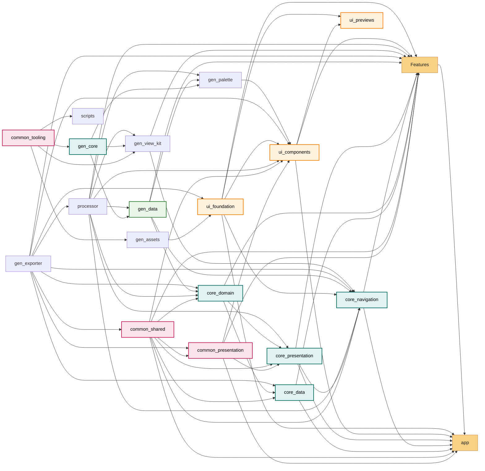
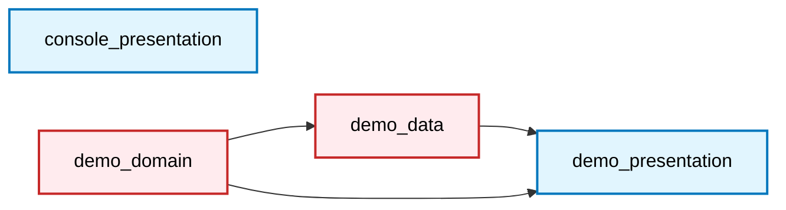
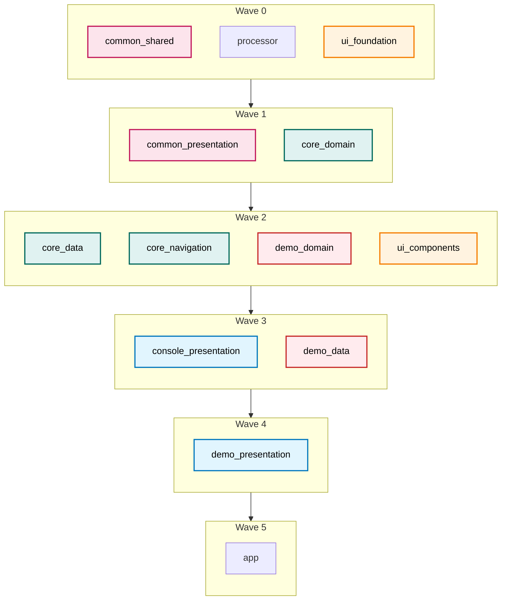
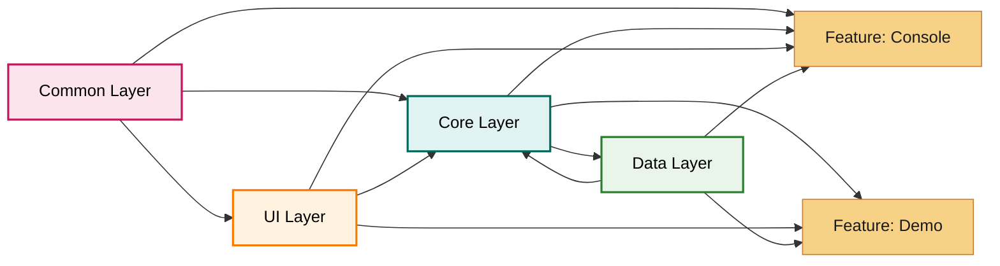

# Module Graphs

## foundation.md

```mermaid
graph LR
    app["app"]
    common_presentation["common_presentation"]
    common_presentation:::common
    common_shared["common_shared"]
    common_shared:::common
    common_tooling["common_tooling"]
    common_tooling:::common
    core_data["core_data"]
    core_data:::core
    core_domain["core_domain"]
    core_domain:::core
    core_navigation["core_navigation"]
    core_navigation:::core
    core_presentation["core_presentation"]
    core_presentation:::core
    gen_assets["gen_assets"]
    gen_core["gen_core"]
    gen_core:::core
    gen_data["gen_data"]
    gen_data:::data
    gen_exporter["gen_exporter"]
    gen_palette["gen_palette"]
    gen_view_kit["gen_view_kit"]
    processor["processor"]
    scripts["scripts"]
    ui_components["ui_components"]
    ui_components:::ui
    ui_foundation["ui_foundation"]
    ui_foundation:::ui
    ui_previews["ui_previews"]
    ui_previews:::ui
    class app feature
    common_tooling --> scripts
    common_presentation --> app
    common_shared --> app
    core_data --> app
    core_navigation --> app
    core_presentation --> app
    ui_components --> app
    ui_foundation --> app
    gen_exporter --> processor
    common_tooling --> gen_core
    common_tooling --> gen_assets
    gen_core --> gen_data
    processor --> gen_data
    gen_core --> gen_palette
    gen_data --> gen_palette
    processor --> gen_palette
    common_tooling --> gen_view_kit
    gen_core --> gen_view_kit
    processor --> gen_view_kit
    gen_exporter --> common_shared
    common_shared --> common_presentation
    gen_exporter --> common_presentation
    common_presentation --> core_presentation
    common_shared --> core_presentation
    core_domain --> core_presentation
    processor --> core_presentation
    common_shared --> core_navigation
    core_presentation --> core_navigation
    processor --> core_navigation
    ui_foundation --> core_navigation
    gen_data --> core_navigation
    gen_exporter --> core_navigation
    gen_view_kit --> core_navigation
    common_shared --> core_data
    core_domain --> core_data
    gen_exporter --> core_data
    common_shared --> core_domain
    processor --> core_domain
    gen_data --> core_domain
    gen_exporter --> core_domain
    gen_assets --> ui_foundation
    gen_exporter --> ui_foundation
    common_presentation --> ui_components
    common_shared --> ui_components
    processor --> ui_components
    ui_foundation --> ui_components
    gen_exporter --> ui_components
    gen_palette --> ui_components
    ui_components --> ui_previews
    ui_foundation --> ui_previews
    features["Features"]
    class features feature
    common_presentation --> features
    common_shared --> features
    core_data --> features
    core_domain --> features
    core_navigation --> features
    core_presentation --> features
    gen_data --> features
    gen_exporter --> features
    gen_view_kit --> features
    processor --> features
    ui_components --> features
    ui_foundation --> features
    features --> app

    classDef data fill:#e8f5e8,stroke:#2e7d32,stroke-width:2px,color:#000000;
    classDef ui fill:#fff3e0,stroke:#f57c00,stroke-width:2px,color:#000000;
    classDef common fill:#fce4ec,stroke:#c2185b,stroke-width:2px,color:#000000;
    classDef core fill:#e0f2f1,stroke:#00695c,stroke-width:2px,color:#000000;
    classDef feature fill:#f6d186,stroke:#c77d39,color:#1b1b1b;
```

## features.md

```mermaid
graph LR
    console_presentation["console_presentation"]
    console_presentation:::presentation
    demo_data["demo_data"]
    demo_data:::data
    class demo_data unused
    demo_domain["demo_domain"]
    demo_domain:::domain
    class demo_domain unused
    demo_presentation["demo_presentation"]
    demo_presentation:::presentation
    demo_domain --> demo_data
    demo_data --> demo_presentation
    demo_domain --> demo_presentation

    classDef presentation fill:#e1f5fe,stroke:#0277bd,stroke-width:2px,color:#000000;
    classDef domain fill:#f3e5f5,stroke:#7b1fa2,stroke-width:2px,color:#000000;
    classDef data fill:#e8f5e8,stroke:#2e7d32,stroke-width:2px,color:#000000;
    classDef unused fill:#ffebee,stroke:#c62828,stroke-width:2px,color:#000000;
```

## waves.md

```mermaid
graph TB
    subgraph wave_cluster_0["Wave 0"]
        direction TB
        common_shared["common_shared"]
        common_shared:::common
        processor["processor"]
        ui_foundation["ui_foundation"]
        ui_foundation:::ui
    end
    subgraph wave_cluster_1["Wave 1"]
        direction TB
        common_presentation["common_presentation"]
        common_presentation:::common
        core_domain["core_domain"]
        core_domain:::core
    end
    subgraph wave_cluster_2["Wave 2"]
        direction TB
        core_data["core_data"]
        core_data:::core
        core_navigation["core_navigation"]
        core_navigation:::core
        demo_domain["demo_domain"]
        demo_domain:::domain
        class demo_domain unused
        ui_components["ui_components"]
        ui_components:::ui
    end
    subgraph wave_cluster_3["Wave 3"]
        direction TB
        console_presentation["console_presentation"]
        console_presentation:::presentation
        demo_data["demo_data"]
        demo_data:::data
        class demo_data unused
    end
    subgraph wave_cluster_4["Wave 4"]
        direction TB
        demo_presentation["demo_presentation"]
        demo_presentation:::presentation
    end
    subgraph wave_cluster_5["Wave 5"]
        direction TB
        app["app"]
    end
    wave_cluster_0 --> wave_cluster_1
    wave_cluster_1 --> wave_cluster_2
    wave_cluster_2 --> wave_cluster_3
    wave_cluster_3 --> wave_cluster_4
    wave_cluster_4 --> wave_cluster_5

    classDef presentation fill:#e1f5fe,stroke:#0277bd,stroke-width:2px,color:#000000;
    classDef domain fill:#f3e5f5,stroke:#7b1fa2,stroke-width:2px,color:#000000;
    classDef data fill:#e8f5e8,stroke:#2e7d32,stroke-width:2px,color:#000000;
    classDef ui fill:#fff3e0,stroke:#f57c00,stroke-width:2px,color:#000000;
    classDef common fill:#fce4ec,stroke:#c2185b,stroke-width:2px,color:#000000;
    classDef core fill:#e0f2f1,stroke:#00695c,stroke-width:2px,color:#000000;
    classDef unused fill:#ffebee,stroke:#c62828,stroke-width:2px,color:#000000;
```

## layers.md

```mermaid
graph LR
    group_Core_Layer["Core Layer"]
    class group_Core_Layer core
    group_Common_Layer["Common Layer"]
    class group_Common_Layer common
    group_UI_Layer["UI Layer"]
    class group_UI_Layer ui
    group_Data_Layer["Data Layer"]
    class group_Data_Layer data
    group_Feature__Console["Feature: Console"]
    class group_Feature__Console feature
    group_Feature__Demo["Feature: Demo"]
    class group_Feature__Demo feature
    group_Common_Layer --> group_Core_Layer
    group_Core_Layer --> group_Data_Layer
    group_UI_Layer --> group_Core_Layer
    group_Data_Layer --> group_Core_Layer
    group_Common_Layer --> group_UI_Layer
    group_Common_Layer --> group_Feature__Console
    group_Core_Layer --> group_Feature__Console
    group_UI_Layer --> group_Feature__Console
    group_Data_Layer --> group_Feature__Console
    group_Core_Layer --> group_Feature__Demo
    group_UI_Layer --> group_Feature__Demo
    group_Data_Layer --> group_Feature__Demo

    classDef data fill:#e8f5e8,stroke:#2e7d32,stroke-width:2px,color:#000000;
    classDef ui fill:#fff3e0,stroke:#f57c00,stroke-width:2px,color:#000000;
    classDef common fill:#fce4ec,stroke:#c2185b,stroke-width:2px,color:#000000;
    classDef core fill:#e0f2f1,stroke:#00695c,stroke-width:2px,color:#000000;
    classDef feature fill:#f6d186,stroke:#c77d39,color:#1b1b1b;
```
