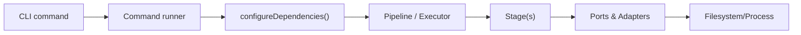

# Scripts CLI

The `scripts/` Dart package hosts all workspace automation (build_runner, module graphing, module scaffolding, locale keys, links). Use FVM.

## Run commands

```bash
cd scripts
fvm dart pub get
```

Prefer the alias installed by the bootstrap script:

```bash
fvms <command> [flags]
```

If the alias is missing:

```bash
fvm dart run scripts <command> [flags]
```

Each command supports `--help`.

## Directory layout

```
scripts/lib/src/
├── core/                       # Base command runner, logging, DI
├── shared/                     # Only truly cross-feature helpers (keep minimal)
└── features/
    ├── build_engine/           # Build orchestration + shared build graph pieces
    │   ├── domain/             # Shared models/ports/adapters (workspace discovery, graph render)
    │   ├── engine/             # Shared services (env, workspace loader, signal utils)
    │   └── features/
    │       ├── codegen/
    │       │   ├── domain/     # Build runner ports, builders, models
    │       │   ├── engine/     # Pipelines, stages, services, gen workflows
    │       │   └── commands/   # build, gen-build/clean/watch, smart-build
    │       └── module_graph/
    │           ├── domain/     # Graph render adapters/styles
    │           ├── engine/     # Dependency analysis, build plan, graph generation
    │           └── commands/   # module-graph
    ├── links/                  # Symlink creators (build/pubspec/yaml)
    │   ├── domain/             # link_creator adapter
    │   └── engine/             # pipelines + stages
    ├── locale/                 # Locale key generation
    │   └── engine/             # pipelines + stages
    └── scaffolding/            # Workspace module tooling
        ├── domain/             # module.yaml/pubspec models + config adapter
        ├── engine/services/    # yaml service + writer (shared by scaffolding features)
        └── features/
            ├── create_module/  # create-module command + pipeline/stages
            └── pub_sync/       # pub-sync command + pipeline/stages
```

Feature convention (per feature):
- `domain/`: pure models and ports/adapters.
- `engine/`: services, pipelines, stages that orchestrate work.
- `commands/<command>/`: thin CLI entry, executor, and command-specific wiring.
- Keep cross-feature code inside the feature first; promote to `shared/` only when multiple features truly depend on it.

## Architecture



Typical flow: `Command -> Executor -> Pipeline -> Stage(s) -> Services -> Ports/Adapters -> IO`.

## Feature notes

- **Build Engine**
  - Shared: `domain/models` (build state, graph config, pipeline context), `domain/ports` (module discovery/graph), `domain/adapters` (workspace discovery, graph render), `engine/services` (env, workspace loader).
  - Codegen feature: gen-build/clean/watch pipelines, smart-build pipeline, build execution services, build runner adapters.
  - Module Graph feature: dependency analyzer, build plan builder, graph generator, module graph command.
- **Scaffolding**
  - Shared: module config models/adapters; YAML service/writer.
  - create-module feature: validate → resolve-template → copy-template → bootstrap-pubspec → register-workspace.
  - pub-sync feature: sync-modules → summarize → pub-get (with optional lock/report/reverse/format behaviours).
- **Links**: create symlinks for build.yaml and pubspec.yaml; pipeline stages `create-links` → `report-links`.
- **Locale**: validate input → collect keys → write output (sealed class of keys).

## Commands

| Command                                                          | Description                                                                                                                         |
| ---------------------------------------------------------------- | ----------------------------------------------------------------------------------------------------------------------------------- |
| `create-module <feature-path> <module-type>`                     | Scaffold a module from `scripts/templates/modules/<module-type>`, bootstrap pubspec, register in the root `pubspec.yaml` workspace. |
| `pub-sync [--modules <name\|path>…] [module…]`                   | Sync all `pubspec.yaml` files from `module.yaml` + `workspace_modules.yaml`; can reverse, format, lock, or report; refreshes graph. |
| `build`                                                          | Mobile build matrix (Android/iOS × mode × flavor); supports `--keep-key-properties`, artifact filters (`--android-aab`/`--android-apk`/`--ios-ipa`/`--ios-app`), and obfuscation/split-debug-info/target-platform defaults. |
| `gen-build [modules…]`                                           | `build_runner build -d` across workspace modules or filtered set (supports `<feature>_feature` shortcuts expanding to data/domain/presentation/data_api/domain_api/presentation_api). |
| `gen-clean [--workers <n>]`                                      | Clean generated files and run `build_runner clean` (multi-worker).                                                                  |
| `gen-watch [modules…] [--pre-build]`                             | `build_runner watch -d`, optionally run `smart-build` first.                                                                        |
| `smart-build [module?] [--dry-run] [--parallel <n>] [--verbose]` | Dependency-aware incremental build with mermaid output.                                                                             |
| `module-graph [--parallel <n>] [--verbose]`                      | Generate dependency graphs and stats without running builds; writes `module_graph.md` and `overview.md`.                            |
| `build-links` / `pubspec-links` / `yaml-links`                   | Symlink build.yaml / pubspec.yaml / both into `yaml/` for inspection.                                                               |
| `locale [--input dir] [--output file]`                           | Emit a `LocaleKeys` class from translation JSON.                                                                                    |

## Module specs (pub-sync)

- `workspace_modules.yaml` (repo root): canonical Dart SDK + package version map.
- Each module has `module.yaml` with:
  - `name`, `modules`/`dev_modules` (workspace deps), `dependencies`/`dev_dependencies` (package names, no versions).
  - Optional `build:` section. `build.manual: true` skips writing `build.yaml`. Any map containing only `include` (+ optional `raw`) is treated as a YAML include.
- `pub-sync` writes `pubspec.yaml` and, if present, `build.yaml`. Modules with only build changes skip `flutter pub get`; pubspec changes trigger a single workspace `pub get`.
- Useful flags: `--check` (dry-run), `--packages <pkg>…`, `--format`, `--reverse`, `--force-all`, `--lock`, `--report`.
  - `--lock` writes `.misc/build_info/modules_lock.yaml`; `--report` writes `.misc/build_info/dependencies.md`.

## Add a new command/feature

1) Create `features/<new_feature>/` with `domain/`, `engine/` (services/pipelines/stages), and `commands/<command>/`.
2) Keep shared logic inside the feature until multiple features need it; only then move to `shared/`.
3) Register the command in `core/command/runner.dart` and DI in `core/di/dependency_setup.dart`.
4) Run `fvm dart analyze` and `fvms <command> --help` to verify wiring.
