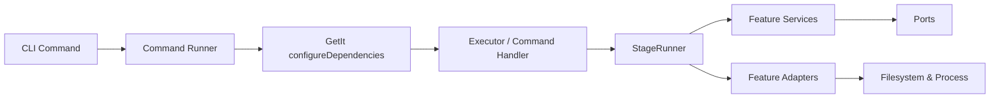

# Scripts CLI

Automation lives in the `scripts/` Dart package. Install dependencies once:

```bash
cd scripts
fvm dart pub get
```

Run commands via FVM (recommended). After running the bootstrap script a shell alias `fvms`
is available and maps to `fvm dart run scripts`:

```bash
fvms <command> [flags]
```

If the alias is unavailable, fall back to:

```bash
fvm dart run scripts <command> [flags]
```

Each command exposes `--help`. Shortcut entrypoints (`scripts:<command>`) are available for frequently used flows.

---

## Directory layout

```
scripts/lib/src/
├── core/                          # Base command/runner, logging, DI setup
├── shared/                        # Only truly cross-feature utils/adapters (e.g., workspace discovery)
└── features/
    ├── codegen/                   # build_runner & build commands (smart-build, gen-*, build)
    ├── module_graph/              # Dependency graph generation
    ├── links/                     # build/pubspec/yaml symlink commands
    ├── locale/                    # Locale key generation
    └── scaffolding/               # module scaffolding / pub-sync
```

- **Core**: `CommandError`, console/logging, command runner, GetIt DI at `core/di`.
- **Shared**: only truly cross-feature pieces (e.g., workspace discovery adapter); keep everything else inside its feature.
- **Features/**: each feature owns its domain models + adapters/services + commands; codegen/build-runner lives under `features/codegen`, command-specific files live under `features/<feature>/commands/<command>/`.

### Adding a new feature/command
- Create `features/<new_feature>/`:
  - `domain/models/` → feature-specific DTOs.
  - `adapters/` → IO/FS/process/builder adapters.
  - `services/` → stateless services/workflows.
  - `stages/` and/or `pipelines/` → if you wire commands via StageRunner.
  - `commands/<command>/` → CLI entry (command.dart) plus command-specific context/stage/pipeline/logic.
- Don’t put code in `shared/` unless it’s truly cross-feature; keep shared stages/services inside the feature first, promote to `shared/` only if multiple features depend on it.
- Register the new command in `core/command/runner.dart`, and add DI bindings in `core/di/dependency_setup.dart` as needed.
- Run `fvm dart analyze` to verify; update this README with the new command summary.

### Flow Architecture overview



When using StageRunner (smart-build/module-graph pipelines), stages typically flow as:
`ValidateEnv → DiscoverModules → AnalyzeDependencies → BuildPlan → (RunBuild | GenerateGraph)`.

## Dependency injection

`core/di/dependency_setup.dart` registers all executors, ports, and services with GetIt. Each CLI command calls `configureDependencies()` before resolving its orchestrator via `getDependency<T>()`. Use GetIt scopes in tests to override registrations.

## Command summary

| Command                                                          | Description                                                                                                                                                                                     |
| ---------------------------------------------------------------- | ----------------------------------------------------------------------------------------------------------------------------------------------------------------------------------------------- |
| `create-module <feature-path> <module-type>`                     | Scaffold a module under `feature/` from `scripts/templates/modules/<module-type>`, bootstrap its pubspec.yaml, and append the module path to the workspace list.                               |
| `pub-sync [--modules <name\|path>…] [module…]`                   | Sync every module’s `pubspec.yaml` from its `module.yaml` plus root `workspace_modules.yaml` definitions and refresh the module graph.                                                    |
| `build`                                                          | Execute the mobile build matrix (Android/iOS × mode × flavour). Use `--flavor`, `--debug`, or `--release` to filter. Artifacts land in `.misc/artifacts/`.                                      |
| `gen-build [modules…]`                                           | Run `build_runner build -d` for all build_runner packages or a filtered set. `foo_feature` expands to `foo_data`, `foo_domain`, `foo_presentation`, `foo_data_api`, and `foo_presentation_api`. |
| `gen-clean [--workers <n>]`                                      | Clean generated files and run `build_runner clean` across modules.                                                                                                                              |
| `gen-watch [modules…] [--pre-build]`                             | Launch `build_runner watch -d`, optionally running `smart-build` first. Accepts the same `<feature>_feature` shortcuts as `gen-build`.                                                          |
| `smart-build [module?] [--dry-run] [--parallel <n>] [--verbose]` | Dependency-aware incremental build orchestration with mermaid output.                                                                                                                           |
| `module-graph [--parallel <n>] [--verbose]`                      | Generate dependency graphs/stats without executing builds.                                                                                                                                      |
| `build-links`                                                    | Symlink all `build.yaml` files into `yaml/builds/`.                                                                                                                                             |
| `pubspec-links`                                                  | Symlink all `pubspec.yaml` files into `yaml/pubspecs/`.                                                                                                                                         |
| `yaml-links`                                                     | Run both linkers sequentially (clears previous output).                                                                                                                                         |
| `locale [--input dir] [--output file]`                           | Produce locale key constants from translation JSON.                                                                                                                                             |

_All commands support `--help` for detailed flags._

### Module specs

`pub-sync` keeps all `pubspec.yaml` files aligned with two lightweight configuration layers:

1. `workspace_modules.yaml` (repo root) stores the canonical Dart SDK constraint plus a `packages:` map of package → version.
2. Each workspace module owns a `module.yaml` with its `name`, `modules`/`dev_modules` (internal workspace dependencies), and `dependencies`/`dev_dependencies` (third-party package names without versions). Optional extras such as `publish_to`, `flutter`, etc. live in the same file.

Modules can also manage their `build.yaml` definitions from `module.yaml` by adding a `build` section. Inline configs are written verbatim as YAML objects:

```yaml
build:
  targets:
    $default:
      builders:
        injectable_generator|injectable_builder:
          enabled: true
```

To avoid duplicating shared templates, any map that contains only `include` (plus an optional `raw` flag) is treated as a YAML include directive. The example below copies `scripts/templates/builds/presentation_build.yaml` into the module before syncing:

```yaml
build:
  include: scripts/templates/builds/presentation_build.yaml
```

Add `raw: true` to copy the file byte-for-byte (preserving comments and formatting). Without `raw`, the included YAML is parsed and re-serialized when `build.yaml` is generated. Include directives are available anywhere inside `module.yaml`—for example a dependency list entry can expand from another file.

Need to manage a module manually? Set:

```yaml
build:
  manual: true
```

or `build: { manual: true }`, and `pub-sync` will leave that module’s `build.yaml` untouched—even when `--force-all` is specified.

`pub-sync` now tracks build file updates separately. Modules that only change `build.yaml` won’t trigger `flutter pub get`, while modules with `pubspec.yaml` edits still run a single workspace `pub get` after syncing.

Running `fvms pub-sync` applies the central versions to every module, then regenerates the module graph outputs. Pass module names or paths to limit the update set: `fvms pub-sync --modules core_data feature/demo/presentation`. Modules that only contain `module.yaml` are automatically bootstrapped with a fresh `pubspec.yaml`. Add `--reverse` to derive minimal `module.yaml` specs from the current `pubspec.yaml` contents (useful after manual pubspec edits); if `workspace_modules.yaml` is missing it will be bootstrapped from the discovered third-party versions.

Additional flags help during maintenance:

- `--check`: dry-run and fail if any pubspec would change (skips graph regeneration).
- `--packages dio retrofit`: only touch modules that depend on the listed packages.
- `--format`: sort & rewrite every `module.yaml` (dedupe lists, lint field order) before syncing.
- `--reverse`: write `module.yaml` files based on the current pubspec dependencies (incompatible with `--format`, `--lock`, and `--report`).
- `--force-all`: rewrite every targeted pubspec/build file even if no diff is detected (helps when you need to normalize formatting or reapply templates).
- `--lock`: emit `build_info/modules_lock.yaml` summarizing every module’s resolved third-party package versions.
- `--report`: emit `build_info/dependencies.md` containing a Markdown dependency digest per module.

Flags can be combined: e.g. `fvms pub-sync --packages dio --lock --report` updates just dio consumers, writes new pubspecs, a lock snapshot, the dependency report, and refreshes the graph in one pass.

### Module graph outputs

Running `module-graph` now produces a single `module_graph.md` in the repo root with four sections (foundation, features, waves, layers) and an `overview.md` summary. Each section heading is the former file name (e.g. `foundation.md`) for easy linking.

## Key workflows

### Build

- Automatically discovers available flavours from `.env.*` files under `app/` and expands the build matrix across all platforms/modes unless filters are provided.
- Uses `BuildExecutor` → Android & iOS builders (`infrastructure/build/*`).
- Android release builds expect signing env vars (`ANDROID_KEYSTORE_PATH`, etc.) or an existing `android/key.properties`.
- Flags: `--flavor <name>`, `--debug`, `--release`, `--android-aab`, `--android-apk`, `--keep-key-properties`, `--no-obfuscate`, `--no-split-debug-info`, `--split-debug-info-path`, `--no-apply-target-platform`, `--target-platform`.

### Gen

- `GenExecutor` discovers modules via `ModuleDiscoveryPort` and drives specific workflows: `build_runner` builds, clean queue (multi-worker), or watch processes.
- `--workers` defaults to half CPU count; `--pre-build` on `gen-watch` triggers smart-build before watchers attach.
- Filters support `<feature>_feature` shortcuts (e.g. `auth_feature`) which expand to every module in that feature’s `data`, `domain`, `presentation`, `data_api`, and `presentation_api` packages. The shortcut works for both `gen-build` and `gen-watch`.

### Smart-build & Module-graph

- Shared module discovery and dependency analysis via `ModuleGraphPort` (`ModuleGraphService`).
- Smart-build executes builds in dependency order; `--dry-run` prints the plan without running.
- Module-graph generates `module_graph.md` (Mermaid diagrams) plus `overview.md` stats.

### Links & Locale

- `LinksExecutor` creates symlinks in `yaml/` for quick inspection.
- `LocaleExecutor` scans JSON translations and writes a `LocaleKeys` class.

## Adding a command

1. Create a command in `lib/src/cli/<name>/command.dart` extending `ScriptsCommand`.
2. Optionally add an options helper in the same folder.
3. Wire the actual work in `application/<domain>/...` (or reuse existing executors).
4. Register the command factory in `core/command/command_registry.dart`.
5. `dart analyze` + `fvms <command> --help` (or `fvm dart run scripts <command> --help`) to confirm wiring.

### Command skeleton

```dart
class ExampleCommand extends ScriptsCommand {
  ExampleCommand() : super(commandName: 'example', commandDescription: '...');

  @override
  Future<int> runCommand() {
    configureDependencies();
    final executor = getDependency<ExampleExecutor>();
    return executor.run();
  }
}
```

## Misc

- Bootstrap script: `sh scripts/bash/bootstrap.sh`
- Logs: `build_logs/`, graphs under `module_graph.md`
- Build artifacts are also staged under `.misc/artifacts/` for grab-and-go archives

Happy automating!

### Module templates

Module scaffolding pulls files from `scripts/templates/modules/<module-type>/`.
Each file is copied into the target module directory and placeholders such as
`{{module_name}}`, `{{feature_name}}`, and `{{module_type}}` are replaced. Add
any additional files (e.g. `lib/` skeletons) to those template folders and they
will be included automatically during `fvms create-module`.

Place a file named `.template_dir` inside any template directory you want to
keep even when it is otherwise empty (e.g. `lib/.template_dir`). The scaffolder
creates the folder but ignores the marker file, keeping generated modules clean.
Each successful run also appends the new module path (relative to repo root) to
the root `pubspec.yaml` `workspace` list and triggers `module-graph` so the
documentation stays up to date.
